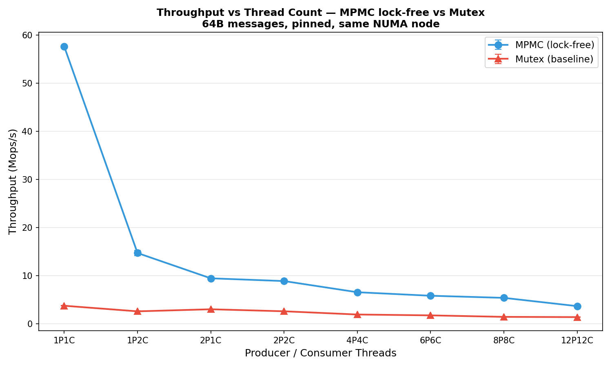

# Low-Latency Lock-Free Queues

High-performance, lock-free queue implementations in C++17 for low-latency systems, compared head-to-head against a mutex baseline, and verified clean under ThreadSanitizer.

## Queue Implementations

### `SPSCQueue<T, Capacity>` : Lock-Free Single-Producer / Single-Consumer

A bounded ring buffer using two cache-line-separated atomics (`head_` for the producer, `tail_` for the consumer). The hot path uses **only acquire/release loads and stores** — no CAS, no locks, no syscalls.

- **Power-of-2 buffer size** — bitwise mask replaces modulo for index wrapping.
- **One slot reserved** to distinguish full from empty without a separate counter.
- **Cache-line padding** between `head_` and `tail_` eliminates false sharing.
- **Cached opposite index** — each side keeps a private, non-atomic copy of the other's index, so the shared atomic is only read when the cache says the queue is full (or empty). Roughly 3x on the hot path; see Design Decisions.

`push`/`pop` must be called from exactly one producer thread and one consumer thread respectively.

### `MPMCQueue<T, Capacity>` : Lock-Free Multi-Producer / Multi-Consumer

An implementation of **Dmitry Vyukov's bounded MPMC ring buffer**. Each slot carries its own sequence number acting as a per-slot state machine; threads claim a slot with a single CAS on a shared ticket index, then publish via a release store on that slot's sequence number.

- **One CAS per operation**, and only on the index — never on the payload.
- **No ABA problem**: sequence numbers are monotonically increasing tickets, not reused pointers.
- **No wasted slot** — the sequence number distinguishes full from empty, so unlike `SPSCQueue` the entire buffer is usable.
- **Safe from any number of concurrent threads** on both sides. Running it with one consumer gives you an MPSC queue for free.

**Lock-free, not wait-free.** System-wide progress is guaranteed, some thread always makes progress, but an individual thread can lose the CAS race repeatedly, so per-thread progress is not bounded.

### `MutexQueue<T, Capacity>` — Baseline (Control Group)

A thread-safe bounded queue using `std::mutex` + `std::condition_variable`. Serves as the **control group** for benchmarking — every lock-free optimization is measured against this. It supports arbitrary producer/consumer counts, so it is swept across the same thread-count matrix as `MPMCQueue`. |

## Correctness

This project verifies correctness three ways:

```bash
make run      # functional + threaded stress tests for all three queues
make tsan     # all three queues under ThreadSanitizer (must be clean)
make sanitize # AddressSanitizer + UndefinedBehaviorSanitizer
```

- The MPMC stress test runs 4 producers × 100,000 items through a deliberately undersized 256-slot queue (forcing genuine backpressure on both the full and empty paths), then verifies **completeness and uniqueness**: every one of the 400,000 unique values must be delivered exactly once. This catches loss, duplication, and payload corruption — none of which a simple produced/consumed counter comparison would detect.
- `make tsan` is the highest-value check. Given the acquire/release design, any ThreadSanitizer report here is a genuine bug, not a false positive. A detected race fails the target rather than printing a warning that scrolls past.

## Build & Run

```bash
# Compile and run all correctness tests
make run

# Verify the lock-free queues under ThreadSanitizer
make tsan

# Compile and run the benchmark (emits CSV)
make run-bench

# Generate charts from the CSV
make plot

# Clean build artifacts
make clean

# Also discard locally-generated bench_results.csv and charts
make clean-results
```

The committed, published figures live in
[`server_results/`](server_results/) and were produced on dedicated hardware :: see that
directory's README for the machine and method.

```bash
./benchmark --help                          # full option list
./benchmark --ops 500000                    # fewer ops per run
./benchmark --configs 1x1,4x4,16x16         # explicit producer x consumer configs
BENCH_PIN=1 ./benchmark                     # pin threads to cores (Linux)

make run-bench BENCH_ARGS="--ops 500000"    # via make
```

## Benchmark Results

### Throughput vs Thread Count (same NUMA node)



MPMC scaling at 64B messages, 2M ops per run:

| Config | MPMC lock-free | Mutex baseline | Speedup   |
| ------ | -------------- | -------------- | --------- |
| 1P1C   | 57.63 Mops/s   | 3.76 Mops/s    | **15.3x** |
| 1P2C   | 14.72 Mops/s   | 2.60 Mops/s    | 5.7x      |
| 2P1C   | 9.46 Mops/s    | 3.03 Mops/s    | 3.1x      |
| 2P2C   | 8.89 Mops/s    | 2.61 Mops/s    | 3.4x      |
| 4P4C   | 6.57 Mops/s    | 1.94 Mops/s    | 3.4x      |
| 6P6C   | 5.84 Mops/s    | 1.76 Mops/s    | 3.3x      |
| 8P8C   | 5.40 Mops/s    | 1.45 Mops/s    | 3.7x      |
| 12P12C | 3.68 Mops/s    | 1.40 Mops/s    | 2.6x      |

Both degrade monotonically as contention rises — a single shared ring is a serialization point, and lock-free makes contention cheaper rather than free.

### Cross-socket cost

| Queue          | Same node    | Cross node   | Penalty   |
| -------------- | ------------ | ------------ | --------- |
| MPMC lock-free | 57.63 Mops/s | 10.04 Mops/s | **5.74x** |
| SPSC lock-free | 17.69 Mops/s | 5.08 Mops/s  | 3.48x     |
| Mutex baseline | 3.76 Mops/s  | 3.46 Mops/s  | 1.09x     |

## Project Structure

```
├── include/
│   ├── spsc_queue.h          # Lock-free SPSC queue
│   ├── mpmc_queue.h          # Lock-free MPMC queue (Vyukov)
│   ├── mutex_queue.h         # Mutex baseline queue
│   └── spin_hint.h           # Portable PAUSE/YIELD spin hint
├── tests/
│   ├── test_spsc_queue.cpp   # SPSC correctness tests + inline bench
│   ├── test_mpmc_queue.cpp   # MPMC correctness tests + inline bench
│   └── test_mutex_queue.cpp  # Mutex correctness tests + inline bench
├── bench/
│   ├── benchmark.cpp         # Head-to-head benchmark with thread sweep
│   └── plot.py               # Chart generation script
├── Makefile                  # Build system
└── server_results/           # Published results from the 48-core Xeon
    ├── same_node.csv         #   pinned, single NUMA node
    ├── cross_node.csv        #   producers node0 / consumers node1
    ├── unpinned.csv          #   scheduler-placed baseline
    ├── environment.txt       #   CPU, NUMA topology, governor state
    ├── tsan.txt              #   ThreadSanitizer log (clean)
    └── *.png                 #   generated charts
```
